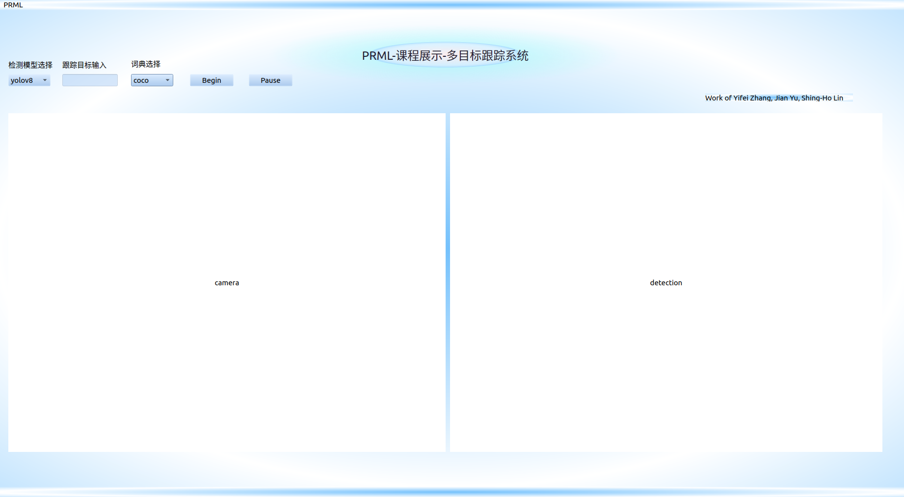

# PRML-MOT
## 环境配置

首先配置原先ByteTrack的环境

```shell
git clone https://github.com/Jamil-Yu/myByteTrack.git
cd ByteTrack
pip3 install -r requirements.txt
python3 setup.py develop
pip3 install cython; pip3 install 'git+https://github.com/cocodataset/cocoapi.git#subdirectory=PythonAPI'
pip3 install cython_bbox
```

安装detectron2

```shell
python -m pip install 'git+https://github.com/facebookresearch/detectron2.git'
# (add --user if you don't have permission)

# Or, to install it from a local clone:
git clone https://github.com/facebookresearch/detectron2.git
python -m pip install -e detectron2

# On macOS, you may need to prepend the above commands with a few environment variables:
CC=clang CXX=clang++ ARCHFLAGS="-arch x86_64" python -m pip install ...
```

安装lvis，clip

```shell
cd detectors
cd object_centric_ovd
pip install -r requirements.txt
```

从[此链接](https://drive.google.com/drive/folders/1Yg6_9lA1TspTxXtqYoQxlYalgafD5qTx?usp=sharing)安装模型，放入model_zoo文件夹


## 运行

* 一个以ovd为为detector，以custom为词典，以bycicle,person,tree为目标的示例：

```shell
python3 my_track.py  -f my_exp.py  --save_result --path /home/workspace/ByteTrack/videos/mot17.mp4 --detector ovd --vocabulary 'custom' --thing_classes 'bicycle,person,tree'
```

注意将path改成本地的视频路径

## UI界面

安装pyqt5包

```shell
pip install pyqt5
```

启动UI界面

```shell
python Main_Window.py
```

出现界面


